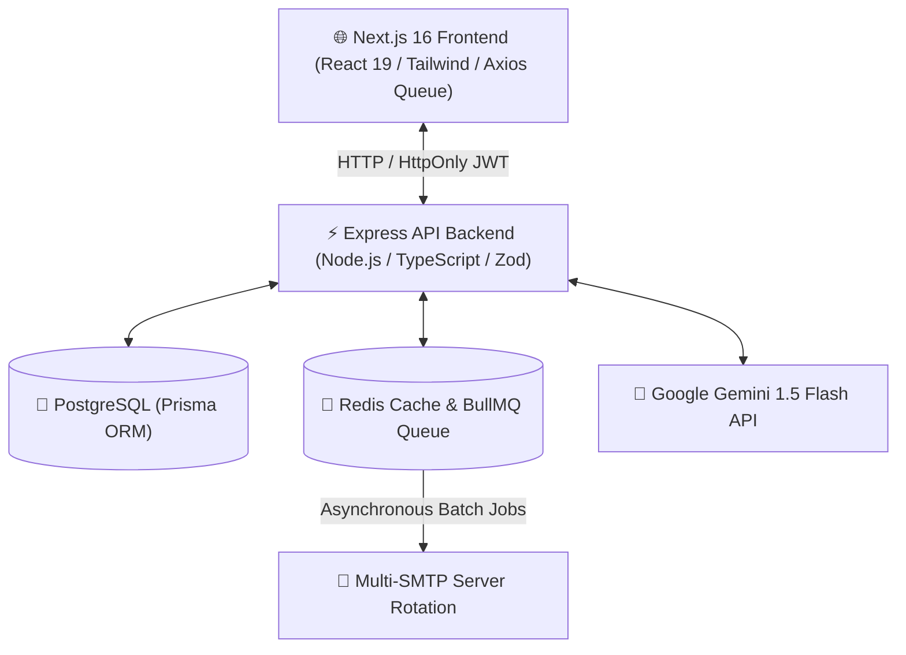

# 📧 MassMailer — Enterprise AI-Powered Cold Outreach Platform

[](#technology-stack)
[](#-ai-pitch-personalizer)
[](#-jwt-authentication--session-security)
[](#-deployment--devops)

---

## 🎯 What MassMailer Solves

Traditional cold email tools struggle with **low deliverability**, **spam flag risks**, **manual customization fatigue**, and **lack of real-time conversion insights**. MassMailer addresses these core pain points through automated, scalable infrastructure and AI intelligence:

### 1. 🚫 Spam Flags & Provider Rate Limits
- **The Problem**: Sending bulk emails from a single SMTP provider triggers IP/domain reputation throttles, spam filters, and strict sending limits.
- **The Solution**: **Multi-SMTP Account Rotation & Health Shield**. MassMailer dynamically load-balances outgoing emails round-robin across multiple active SMTP accounts, preserving domain authority and staying well within provider rate limits.

### 2. ⏳ High Personalization Overhead
- **The Problem**: Sending generic, unpersonalized emails leads to lower reply rates (under 2%), while writing personalized cold pitches for hundreds of prospects manually takes hours.
- **The Solution**: **AI Pitch Personalizer (Google Gemini API)**. Generates highly tailored, context-aware email pitches per recipient based on target company, role, skills, and outreach goals in seconds.

### 3. 🔍 Blind Outreach Without Analytics
- **The Problem**: Marketers and recruiters send campaigns without knowing if emails are opened, links are clicked, or messages bounce.
- **The Solution**: **Real-Time Open & Click Tracking**. Automatically embeds zero-footprint transparent $1\times1$ pixel tags and custom link rewrite redirects to measure exact Open Rates (%), Click-Through Rates (CTR), and engagement metrics.

### 4. 📉 Low Response Rates Due to Lack of Follow-ups
- **The Problem**: Over 60% of cold email conversions occur on follow-up emails, yet manual follow-up scheduling is error-prone and time-consuming.
- **The Solution**: **Automated Multi-Step Follow-Up Sequences**. Asynchronous BullMQ background workers schedule and trigger conditional multi-step follow-ups tailored to recipient activity.

---

## 🚀 Key Features & Capability Matrix

### 🔐 1. JWT Authentication & Session Security
- **Dual-Token System**: Short-lived Access Token (`15m`) paired with long-lived Refresh Token (`7d`).
- **HttpOnly Cookies + LocalStorage Fallback**: Ensures protection against XSS and CSRF attacks while supporting flexible header-based client calls.
- **Silent Auto-Refresh Interceptor**: Client-side Axios response queue automatically detects `401 Unauthorized` responses and silently requests new access tokens without interrupting the user's workflow.

### 📊 2. Real-Time Tracking Engine
- **Invisible Tracking Pixel**: Automatically appends `/api/track/open/:recipientId` transparent $1\times1$ PNG image tags to outgoing HTML email bodies.
- **Click Rewrite Engine**: Rewrites hyperlinks in emails to route through `/api/track/click/:recipientId?url=...` for tracking link interactions before redirecting to the target URL.
- **Live Metrics Dashboard**: Visualizes aggregate metrics (Sent, Delivered, Opened, Clicked, Bounced, Open Rate %, CTR %).

### 📝 3. Reusable Email Templates Library
- **Template Management**: Full CRUD operations to create, edit, organize, and preview email templates with subject line dynamic tags (`{{firstName}}`, `{{company}}`, `{{jobTitle}}`).
- **One-Click Wizard Integration**: Select saved templates directly within the Campaign Creator wizard to instantly prefill email bodies and subject lines.

### ✨ 4. AI Pitch Personalizer (Gemini API)
- **Prompt Engineering Engine**: Interfaces with Google Gemini 1.5 Flash API to craft custom cold outreach proposals.
- **Contextual Input**: Takes target company, candidate/prospect role, key highlights, tone (Professional, Conversational, Direct), and length guidelines to produce high-converting copy.

### 🔄 5. Multi-SMTP Rotation & Health Shield
- **Round-Robin Load Balancing**: Evenly distributes batch mailings across all configured active SMTP servers (Gmail, SendGrid, Mailgun, Amazon SES, Custom SMTP).
- **Interactive Live Connection Tester**: Validates credentials and server health before adding SMTP accounts to active rotation.

### 📈 6. Advanced Analytics & Visual Dashboard
- **Time-Series Charts**: Interactive visuals displaying campaign engagement over time.
- **Export Capabilities**: Export campaign reports and recipient engagement metrics in CSV format for CRM integration.

### 💼 7. HR & Recruiter Contact Directory
- **Bulk CSV Importer**: Parse and import hundreds of candidate or sales lead contacts instantly.
- **Interactive Outreach Drawer**: Trigger personalized single or batch outreach straight from the recruiter directory view.

---

## 🛠️ Technology Stack & Efficiency Architecture



| Component | Technology | Rationale & Efficiency Advantage |
| :--- | :--- | :--- |
| **Frontend Framework** | **Next.js 16 (App Router)** | Server-side rendering (SSR), Turbopack compilation for rapid load times, dynamic client components. |
| **Styling & UI** | **Tailwind CSS + Glassmorphism** | Custom dark-mode theme tokens, responsive layouts, smooth CSS keyframe micro-animations. |
| **Backend Core** | **Node.js & Express (TypeScript)** | Strongly typed architecture, rapid asynchronous non-blocking event loop execution. |
| **Database & ORM** | **PostgreSQL & Prisma ORM** | Schema safety, connection pooling, high-performance relational queries with auto migrations. |
| **Queue & Worker Engine** | **Redis + BullMQ** | Offloads email sending and scheduled follow-ups to async worker processes with retry backoff & concurrency controls. |
| **Authentication** | **Dual JWT (Access + Refresh)** | Secure stateless token verification with 15-minute rotation and 7-day silent refresh. |
| **AI Personalization** | **Google Gemini API** | Ultra-fast text generation model delivering personalized copy in sub-seconds. |
| **Containerization** | **Docker & Docker Compose** | Multi-stage Alpine Linux container builds ensuring lightweight footprint (<150MB) and seamless deployment. |

---

## ⚡ Performance & Scalability Highlights

- **Asynchronous Execution**: Email dispatch operates decoupled from HTTP request loops, allowing instant campaign creation responses regardless of list size ($10,000+$ recipients).
- **Token Queue Resilience**: Prevents duplicate refresh token requests during concurrent API failures via a client-side interceptor request queue.
- **Resource Footprint**: Containerized Alpine images reduce RAM consumption under load to under **200MB** for backend services and **150MB** for Redis cache.
- **Zero-Downtime Migration**: Database schema updates are controlled via Prisma migrations (`npx prisma migrate dev`), protecting data integrity.

---

## 🚀 Quick Deployment Guide

### Prerequisites
- [Docker & Docker Compose](https://www.docker.com/) installed on the system.

### Running with Docker Compose

1. **Clone the Repository**:
   ```bash
   git clone https://github.com/Souvikmsd7/Massmailing.git
   cd Massmailing
   ```

2. **Configure Environment Variables**:
   Ensure `.env` in `backend/` and `frontend/` are updated with `DATABASE_URL`, `JWT_SECRET`, `REDIS_URL`, and `GEMINI_API_KEY`.

3. **Spin Up All Services**:
   ```bash
   docker compose up -d --build
   ```

4. **Access Applications**:
   - **Frontend App**: `http://localhost:3000`
   - **Backend API**: `http://localhost:4000/api/health`
